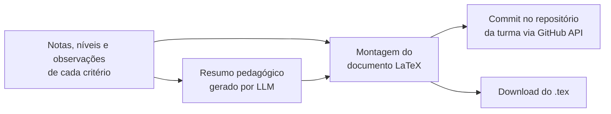
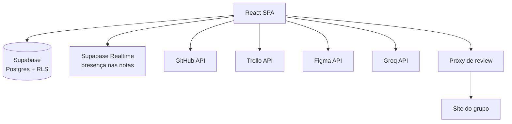

# Atelier.sh

Plataforma de gestão e avaliação de projetos acadêmicos em grupo, feita para acompanhar várias turmas ao mesmo tempo, avaliar por critério e devolver aos alunos uma devolutiva formal.

<div align="center">


</div>

<!-- Adicionar aqui 2 ou 3 capturas de tela: painel de grupos, aba de avaliação e editor de review. -->

## Sobre

O Atelier.sh nasceu dentro de sala de aula. Em 2026, nas turmas de Desenvolvimento de Sistemas da ETE Cícero Dias, eu acompanhava vários grupos em três disciplinas ao mesmo tempo (Design Thinking, Design Centrado no Usuário e Projeto Integrador), e as informações estavam espalhadas: repositórios no GitHub, quadros no Trello, protótipos no Figma, notas em planilha e observações em papel.

A plataforma junta tudo isso em um lugar e transforma a avaliação em um processo com regras explícitas. Ela foi usada durante o semestre de março a julho de 2026 e reduziu em cerca de 60% o tempo que eu gastava acompanhando os grupos.

## Funcionalidades

**Grupos e projetos**
- Organizações com várias turmas, projetos e grupos, com convite de membros por link.
- Página de cada grupo com os dados do repositório (commits, issues e atas de reunião), o quadro do Trello e os arquivos do Figma.
- Painel de grupos com indicador de atividade recente.

**Avaliação**
- Avaliação por critério dentro de cada fase de cada disciplina, com checklist pedagógico de apoio.
- Nota individual calculada a partir da nota do grupo e da contribuição de cada aluno.
- Rodadas de reavaliação, com status automático de correção.
- Critérios extras compensatórios, com teto.
- Registro de conduta e engajamento com justificativa.

**Devolutivas**
- Geração da devolutiva em LaTeX, com resumo escrito por IA, publicada direto no repositório da turma.

**Review de entregas**
- Editor que abre o site do grupo e permite anotar por cima: comentário, marcação de certo e errado, desenho, marca-texto e captura de tela.

**Notas colaborativas**
- Editor rico (TipTap) com pastas, templates, tabelas e listas de tarefas.
- Presença em tempo real: quem está editando a mesma nota aparece na barra superior.

**Governança**
- Papéis por organização (`owner`, `admin`, `member`, `viewer`) e permissões por membro.
- Log de atividades da organização.

## O sistema de avaliação

A avaliação é a parte central do projeto. Ela foi desenhada para ser justa com quem trabalhou e transparente para quem recebe a nota.

### Nota do grupo por critério

Cada critério tem uma nota máxima. Em vez de dar uma nota solta, o docente escolhe um **nível**, que combina completude e qualidade, e o nível gera a nota:

| Nível | % da nota máxima |
|---|---|
| Completo | 100% |
| Completo com ressalvas | 85% |
| Completo, mas inadequado | 70% |
| Faltou pouco | 65% |
| Faltou pouco, com erros | 60% |
| Faltou muito | 40% |
| Faltou muito e errou | 25% |
| Errado | 10% |
| Não fez | 0% |

O checklist de cada critério serve de apoio para escolher o nível, mas não calcula a nota sozinho. Atrasos geram desconto de 10% a 30%, e a não entrega zera o critério.

### Nota individual

A nota de cada aluno parte da nota do grupo em cada fase, multiplicada pelo fator de contribuição dele naquela fase:

| Fator | Multiplicador |
|---|---|
| Liderou | 1,00 |
| Participou | 1,00 |
| Participou pouco | 0,70 |
| Só fez a sua parte | 0,40 |
| Não participou | 0,00 |

```
nota individual da fase = nota do grupo na fase × multiplicador do fator
```

Assim, dois alunos do mesmo grupo podem ter notas diferentes, e o motivo fica registrado. Os fatores podem ser personalizados por organização.

Conduta e engajamento funcionam como uma camada separada: não dão bônus, porque a boa postura é o esperado, e só geram desconto quando há ocorrência, sempre com justificativa registrada.

### Reavaliação

Cada critério pode ter uma rodada inicial e uma rodada final. O docente define qual rodada vale em cada fase, e o sistema calcula o status da correção:

- **Não corrigido:** a nota final não subiu.
- **Parcial:** a nota subiu, mas não chegou ao máximo.
- **Corrigido:** a nota final atingiu o máximo.

### Critérios extras

Critérios marcados como extras não somam direto na nota. Eles só preenchem o que falta até o teto da disciplina:

```
total = base + min(extra, teto − base)
```

Isso permite recompensar um esforço adicional sem que a nota passe do máximo.

## Pipeline de devolutivas



1. O sistema coleta as notas vigentes de cada critério, respeitando a rodada escolhida e o filtro de disciplina ou fase.
2. Se houver chave da Groq configurada, os dados vão para um LLM (Llama 3) com um prompt que pede um resumo de 8 a 10 linhas: nota total, pontos fortes, pontos de atenção e próximos passos. Sem chave, a devolutiva sai sem o resumo.
3. O documento é montado em LaTeX e enviado ao repositório da turma, organizado por turma, grupo e fase.

## Arquitetura

| Camada | Tecnologia |
|---|---|
| Interface | React 19, Vite, React Router |
| Editor de notas | TipTap, Turndown (exportação para Markdown) |
| Arrastar e soltar | dnd-kit |
| Backend | Supabase: PostgreSQL, Auth, Realtime e Row Level Security |
| Funções serverless | Vercel |
| IA | Groq (Llama 3) |
| Integrações | GitHub API, Trello API, Figma API |



### Estrutura de pastas

```
src/
├── pages/        # telas: grupos, projetos, avaliações, notas, log, configurações
├── components/
│   ├── groups/   # cards, detalhe do grupo, aba de avaliação, devolutiva, review
│   ├── notes/    # árvore de pastas, editor, presença
│   └── layout/   # sidebar e gestão da organização
├── hooks/        # acesso a dados e regras de negócio (useAvaliacao, useRole...)
├── lib/          # clientes do Supabase, GitHub, Trello e Figma
└── data/         # disciplinas, fases, critérios, níveis e descontos
api/              # funções serverless da Vercel
proxy-server.js   # proxy local para o editor de review
```

As regras de negócio ficam nos hooks, e não nos componentes. `useAvaliacao` concentra as notas do grupo, as rodadas e os extras. `useAvaliacaoIndividual` concentra os fatores, a conduta e o engajamento.

## Modelo de dados

| Domínio | Tabelas |
|---|---|
| Organização | `organizations`, `org_members`, `org_invites`, `member_permissions`, `profiles` |
| Projetos | `groups`, `github_cache`, `reviews` |
| Notas | `notes`, `note_folders`, `note_templates` |
| Avaliação | `avaliacoes_grupo`, `avaliacoes_individual`, `avaliacoes_contribuicao`, `avaliacoes_comportamental`, `avaliacoes_extra`, `avaliacoes_criterios_custom` |
| Auditoria | `activity_log` |

Todas as tabelas de avaliação têm Row Level Security: só o dono da organização lê e escreve as notas. Para descobrir o papel do usuário, o app tenta a função RPC `get_my_role` e, se ela não existir no banco, consulta `org_members` diretamente.

## Rodando localmente

Requisitos: Node.js 20 e Yarn.

```bash
yarn
yarn dev
```

Variáveis de ambiente (`.env`):

| Variável | Uso |
|---|---|
| `VITE_SUPABASE_URL` | URL do projeto Supabase |
| `VITE_SUPABASE_ANON_KEY` | Chave pública do Supabase |
| `VITE_TRELLO_API_KEY` | Chave da aplicação no Trello |
| `VITE_PROXY_URL` | Endereço do proxy de review (padrão: `http://localhost:3131`) |

O banco é criado executando os scripts SQL na ordem: `supabase_schema.sql`, `supabase_migration_v10.sql`, `supabase_migration_v10_fix.sql`, `supabase_migration_v11.sql`, `supabase_migration_v12.sql`, `supabase_migration_v13.sql` e `supabase_fix_accept_invite.sql`.

Os tokens do GitHub, da Groq e do Figma são pessoais e ficam na tela de Configurações, não no `.env`.

O editor de review depende do proxy, que remove os cabeçalhos que impedem um site de abrir dentro de um iframe:

```bash
node proxy-server.js
```

## Limitações conhecidas

- **Disciplinas no código:** as disciplinas, as fases e os critérios da ETE estão em `src/data/criterios.js`. Critérios personalizados ficam no banco, mas uma nova disciplina ainda exige alterar esse arquivo.
- **Proxy local:** o editor de review só funciona com o proxy rodando. Ele não está publicado junto com o app.
- **Tokens no navegador:** os tokens de integração ficam salvos nas configurações do usuário e são espelhados no `localStorage`.
- **`api/claude.js`:** a função serverless para a API da Anthropic existe, mas nenhuma tela a usa hoje. O resumo das devolutivas usa a Groq.

## Licença

© 2026 Samara Silvia Sabino. Todos os direitos reservados.

Este repositório é público apenas para consulta e avaliação como portfólio. Não é permitido copiar, modificar, distribuir ou usar o código, total ou parcialmente, sem autorização por escrito da autora. Veja os termos completos em [LICENSE](LICENSE).

## Autora

**Samara Silvia Sabino** · Desenvolvedora Frontend e UX/UI · Mestranda em Engenharia de Software no CIn/UFPE

[LinkedIn](https://www.linkedin.com/in/samara-silvia-9a2a26231) · [GitHub](https://github.com/SamaraSilvia81) · [Portfólio](https://samarasilviadev.vercel.app)
